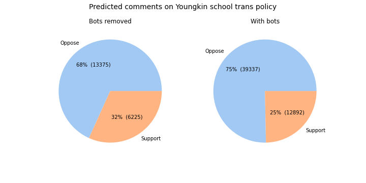
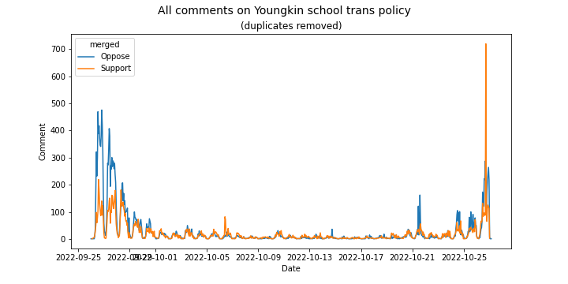

# Townhall

On 2022-09-26, the public comments opened for [Governor Youngkin's Model Policies for the Treatment of Transgender Students in Virginia’s Public Schools](https://townhall.virginia.gov/L/Comments.cfm?GDocForumID=1953). This project is an attempt to (a) download those comments with minimal overhead, (b) classify them into "support" vs "oppose", and (c) perform some further analysis - clustering and exploratory text analysis - as time permits.

