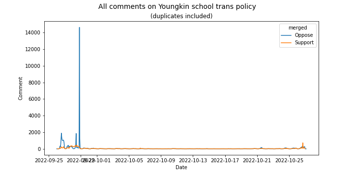
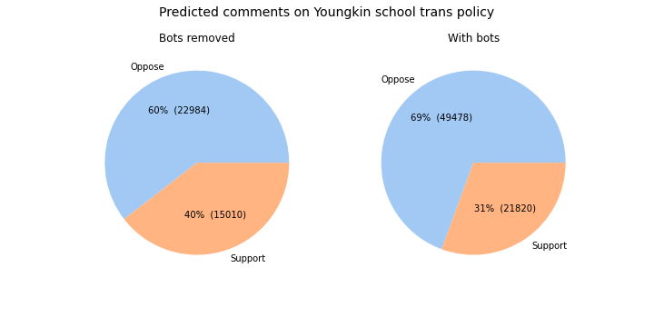

# Townhall

On 2022-09-26, the public comments opened for [Governor Youngkin's Model Policies for the Treatment of Transgender Students in Virginia’s Public Schools](https://townhall.virginia.gov/L/Comments.cfm?GDocForumID=1953). It quickly gathered the most public comments of any policy on the Virginia Townhall site.

This project aims to (a) download those comments with minimal overhead, (b) classify them into "support" vs "oppose", and (c) perform some further analysis - clustering and exploratory text analysis - as time permits.

## Scraping

Scraping was fairly straightforward. To minimize client/server overhead, I used a paginated endpoint which supported 999 comments per page. Collected fields include Comment, Comment Title, CommentID, Commenter, and Date.

Raw output is written to [all_comments.csv](all_comments.csv).

## Removing apparent bots

The raw data was about 40% apparent bots - groups of identical comments, often submitted thousands at a time. After removing comments with 5+ duplicates, the submission rate looked more like human activity, with night/day cycles.

## Classification

Since most (55%) of the comment titles literally contained the words "support" or "oppose", those comments provided an easy way to bootstrap labels for a simple random forest classifier with TF/IDF. The model had 99% accuracy on the labeled training data. I spot-checked a number of predictions for the unlabeled data, and they seemed reasonably good as well, so I used the predictions as an overall estimate of support vs. oppose classification.

